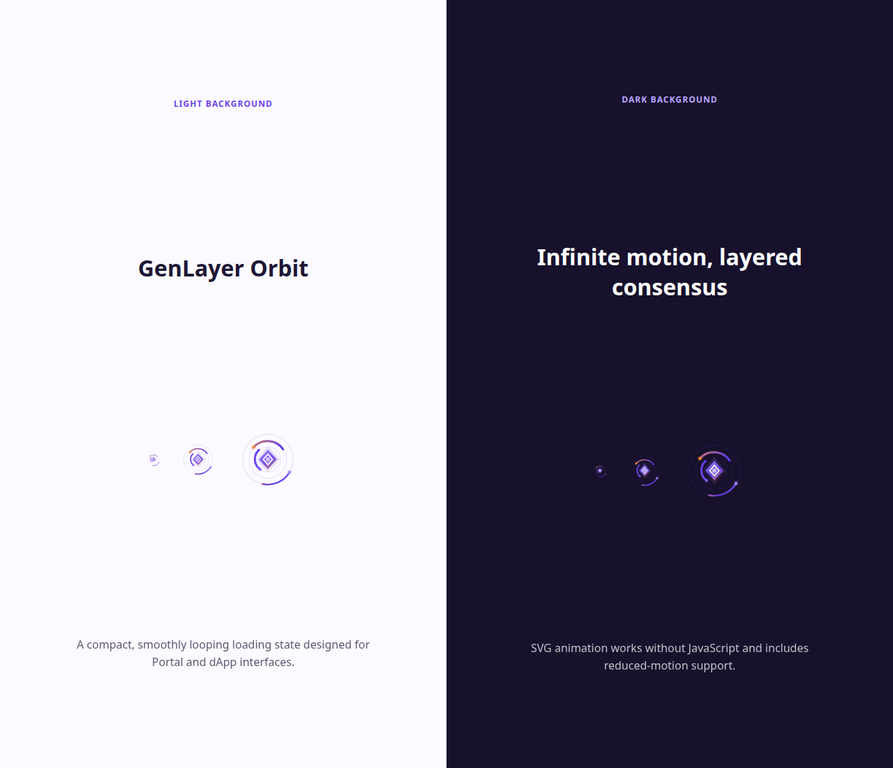

# GenLayer Orbit Spinner

**GenLayer Orbit Spinner** is an original, lightweight loading-state asset created for the GenLayer Portal. Its layered orbital paths represent independent activity converging around a shared geometric core, while the violet-to-amber gradient echoes the Portal’s expressive product tone.

The asset is delivered as a web-ready animated SVG, requires no JavaScript, loops infinitely, and remains legible at compact sizes. The provided demo presents it on both light and dark backgrounds.



## Deliverables

| File | Purpose |
|---|---|
| `genlayer-orbit-spinner.svg` | Standalone animated SVG asset. |
| `spinner.css` | Optional CSS sizing helpers. |
| `demo.html` | Responsive light/dark preview page. |

## Usage

Add the SVG directly to a page:

```html

```

Then optionally include `spinner.css` for consistent sizing:

```html
<link rel="stylesheet" href="spinner.css" />
```

Available sizing classes are `genlayer-spinner--sm` (24px), the default 56px size, and `genlayer-spinner--lg` (96px).

## Design notes

The design uses three independently rotating orbits, each with a distinct phase and speed. Their motion gives a smooth, continuous reading without abrupt resets. A pulsing, layered diamond core offers a compact visual shorthand for the GenLayer identity, while the transparent background makes the asset portable across Portal surfaces.

The SVG contains a `prefers-reduced-motion` media query. When a user enables reduced motion, the animation stops while the geometric loading mark remains visible.

## License

MIT License. See `LICENSE`.
